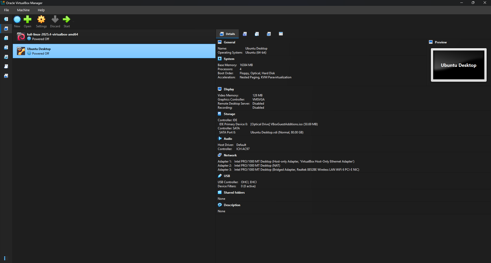
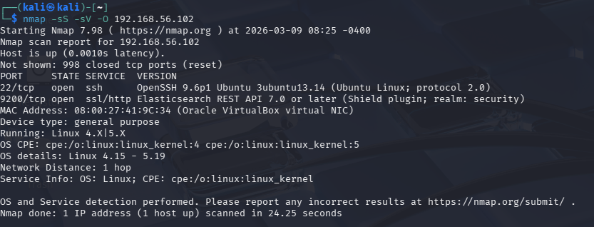
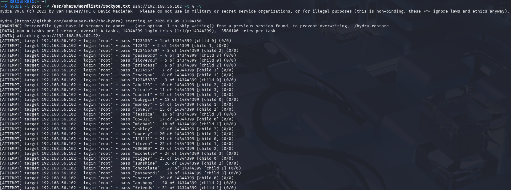
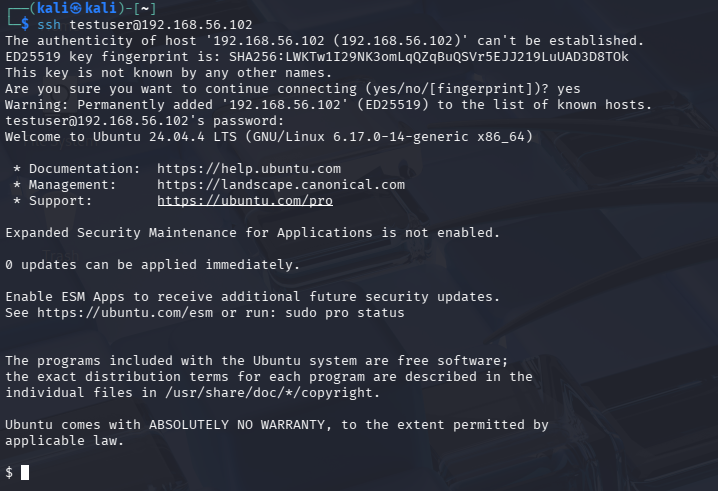
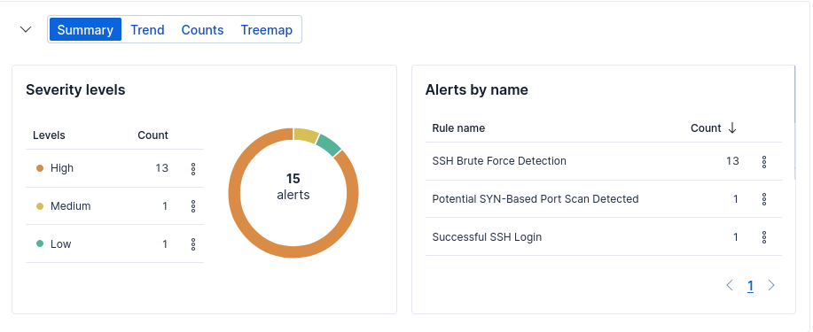
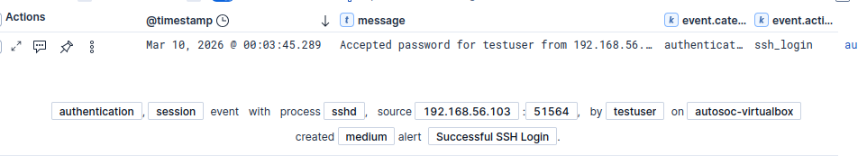
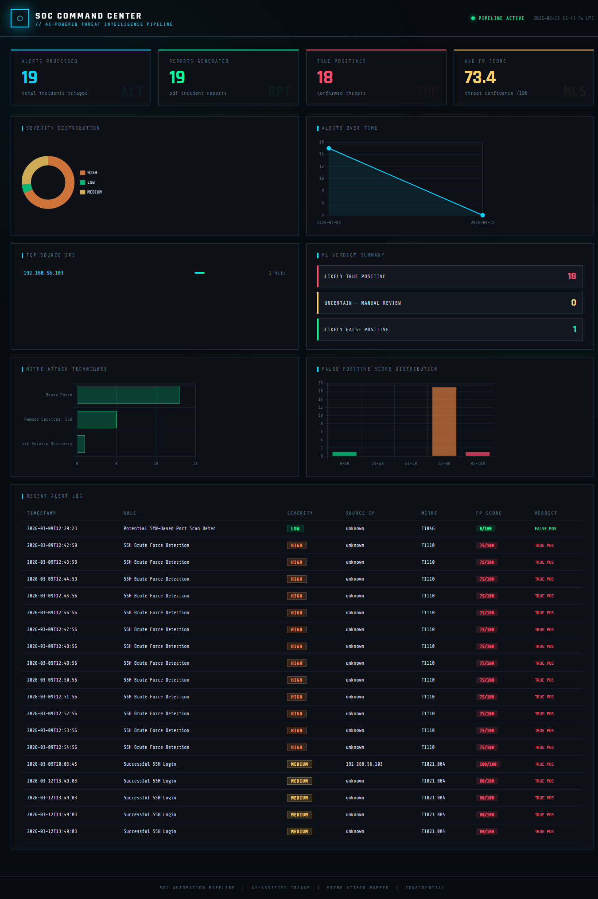
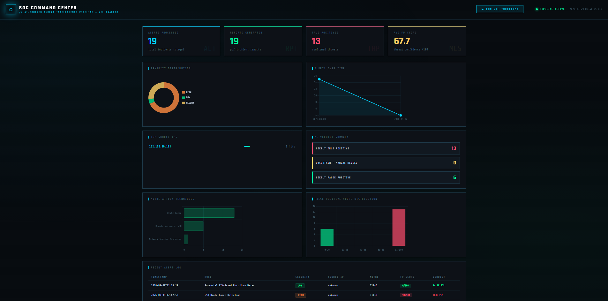
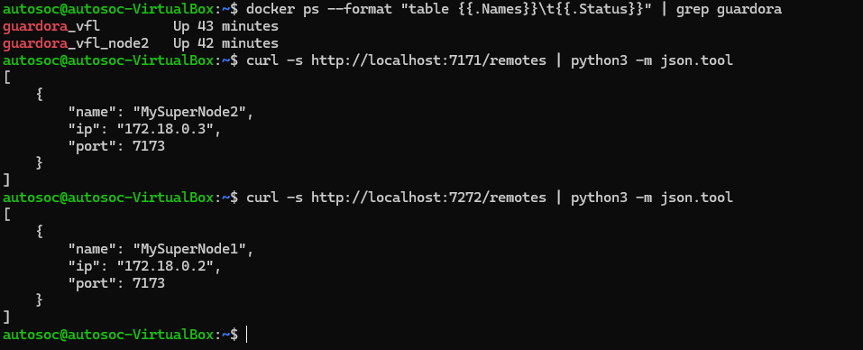
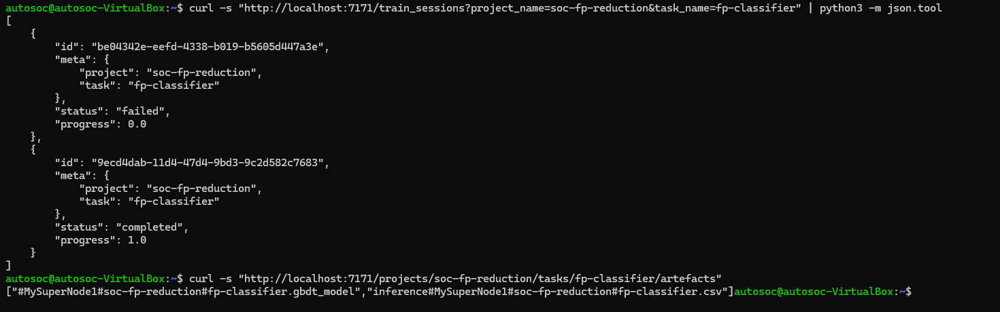

# SOC Automation Pipeline

### AI-Powered Threat Triage, MITRE ATT&CK Mapping & Federated Machine Learning


---

## Overview

This project is a proof-of-concept SOC (Security Operations Centre) automation pipeline that addresses one of the biggest challenges in enterprise security today: **alert fatigue**.

SOC analysts are drowning in thousands of alerts daily — the majority of which are false positives. This pipeline demonstrates how AI and federated machine learning can automatically triage, classify, and respond to SIEM alerts without human intervention, mirroring what vendors like Microsoft Sentinel, Palo Alto XSIAM, and CrowdStrike Charlotte AI are actively building and selling.

The pipeline has two layers of intelligence:

- **LLM triage** via Ollama (phi3:mini) for natural language analysis and runbook generation
- **Federated ML scoring** via Guardora VFL for privacy-preserving false positive classification across distributed data sources

> **This is not just a lab exercise.** It is a working proof-of-concept for a real problem that companies are actively spending millions to solve.

---

## What It Does

When a security alert fires in Elastic SIEM, instead of an analyst manually investigating it, the pipeline:

1. **Detects** — Polls Elastic SIEM automatically for new open alerts
2. **Understands** — Sends the alert to a local LLM (phi3:mini via Ollama) for AI-powered triage
3. **Contextualises** — Maps the alert to the MITRE ATT&CK framework, identifying the technique, tactic, and predicted next steps in the attack chain
4. **Scores (Federated ML)** — Runs a trained GBDT model via Guardora VFL across two federated nodes, each holding different alert features, without either node exposing its raw data to the other
5. **Responds** — Generates a recommended analyst runbook with immediate containment steps
6. **Documents** — Produces a formal PDF incident report automatically
7. **Visualises** — Displays all processed alerts in a real-time web dashboard with VFL-powered scoring

---

## Architecture

```
Elastic SIEM (Kibana)
        │
        │  REST API (Elasticsearch Query)
        ▼
┌─────────────────────────────────────────────────────────┐
│               SOC Automation Pipeline                   │
│                                                         │
│  ┌─────────────┐    ┌────────────────┐                  │
│  │ Alert Parser│───▶│ MITRE Mapper  │                  │
│  └─────────────┘    └────────────────┘                  │
│          │                  │                           │
│          ▼                  ▼                           │
│  ┌─────────────┐    ┌────────────────┐                  │
│  │  Ollama LLM │    │  PDF Report    │                  │
│  │ (phi3:mini) │    │  Generator     │                  │
│  └─────────────┘    └────────────────┘                  │
│          │                                              │
│          ▼                                              │
│  ┌───────────────────────────────────────────────────┐  │
│  │              Guardora VFL Layer                   │  │
│  │                                                   │  │
│  │  ┌─────────────────┐     ┌─────────────────────┐  │  │
│  │  │  Node 1         │     │  Node 2             │  │  │
│  │  │  (risk_score,   │     │  (severity,         │  │  │
│  │  │  source_port,   │◀──▶│  rule_name,         │  │  │
│  │  │  event features,│     │  hostname,          │  │  │
│  │  │  target label y)│     │  user features)     │  │  │
│  │  └─────────────────┘     └─────────────────────┘  │  │
│  │         │  PSI Record Linkage (no raw data share) │  │
│  │         │  Federated GBDT Training & Inference    │  │
│  │         ▼                                         │  │
│  │  ┌─────────────────┐                              │  │
│  │  │  FP Score 0–100  │                             │  │
│  │  │  + Verdict       │                             │  │
│  │  └─────────────────┘                              │  │
│  └───────────────────────────────────────────────────┘  │
│          │                                              │
│          ▼                                              │
│   ┌──────────────────┐                                  │
│   │  alert_log.json  │                                  │
│   └──────────────────┘                                  │
└─────────────────────────────────────────────────────────┘
        │
        ▼
  Flask Dashboard (http://vm-ip:5000)
  [RUN VFL INFERENCE button triggers full pipeline]
```

---

## Key Features

### AI-Powered Triage

The pipeline sends each alert to a locally-hosted LLM (phi3:mini via Ollama) with a structured prompt that returns:

- Severity assessment (true positive / false positive likelihood)
- Attack summary and attacker intent
- Recommended response runbook (5 immediate actions)
- Containment recommendations
- Investigation notes for the analyst

### MITRE ATT&CK Mapping

Each alert is automatically mapped to the MITRE ATT&CK framework, including:

- Technique ID and name (e.g. T1110 — Brute Force)
- Tactic (e.g. Credential Access)
- Predicted next steps in the attack chain

### Federated ML False Positive Scoring (Guardora VFL)

This is the major upgrade over a standard rule-based scorer. Instead of scoring alerts on a single machine with access to all data, the pipeline uses **Vertical Federated Learning** across two nodes — each holding different feature sets for the same alerts.

**Why this matters:** In real enterprise environments, alert data is split across teams and systems. Network features sit with the network team. User behaviour data sits with the identity team. Neither team can share raw data with the other for compliance reasons. VFL allows a shared model to be trained and run across these silos without either party exposing their data.

**How it works:**

1. Alert data is split by feature type across two Guardora VFL nodes
2. **PSI (Private Set Intersection)** identifies which alerts exist on both nodes without revealing the records themselves
3. A **GBDT (Gradient Boosted Decision Tree)** model is trained federally across both nodes — gradients are exchanged, not raw data
4. At inference time, new alerts are scored by the federated model and each alert receives a `logit` score (0–1 probability of true positive)
5. Scores are written back to `alert_log.json` and displayed on the dashboard

**Feature split:**

| Node 1 | Node 2 |
|--------|--------|
| risk_score | severity |
| source_port | rule_name |
| event_action | hostname |
| event_outcome | username |
| target label (y) | event_category |
| | process |

Each alert receives a **0–100 confidence score** and a verdict:

- `LIKELY TRUE POSITIVE` (≥ 70)
- `UNCERTAIN — MANUAL REVIEW RECOMMENDED` (40–69)
- `LIKELY FALSE POSITIVE` (< 40)

### Automated PDF Incident Reports

Every processed alert generates a formal PDF report including:

- Incident metadata (alert ID, timestamp, rule triggered)
- Attack details (source IP, target host, username, process)
- MITRE ATT&CK mapping
- VFL false positive score and verdict
- Full AI triage analysis and runbook
- Analyst sign-off section

### Real-Time Web Dashboard

A Flask-powered dashboard visualises the full pipeline output:

- Total alerts processed, reports generated, confirmed threats
- Severity breakdown (doughnut chart)
- Alerts over time (timeline chart)
- Top source IPs with hit frequency
- MITRE ATT&CK technique distribution
- False positive score histogram
- ML verdict summary (True Positive / Uncertain / False Positive counts)
- Recent alert log table with per-alert VFL scores
- **One-click VFL inference button** — triggers the full federated scoring pipeline on demand

---

## Tech Stack

| Component | Technology |
|-----------|------------|
| SIEM | Elastic Security / Kibana 9.x |
| Log Shipping | Filebeat |
| AI / LLM | Ollama + phi3:mini (3.8B) |
| Federated ML | Guardora VFL (Vertical Federated Learning) |
| ML Model | GBDT (Gradient Boosted Decision Tree) |
| Record Linkage | PSI (Private Set Intersection) via GRPC |
| VFL Infrastructure | Docker (two-node setup) + MLflow |
| PDF Generation | fpdf2 |
| Dashboard | Flask + Chart.js |
| Attack Simulation | Kali Linux |
| Language | Python 3.10+ |

---

## Setup & Installation

### Prerequisites

- Ubuntu 22.04 / 24.04
- Elastic Stack 9.x (Elasticsearch + Kibana + Filebeat)
- Ollama installed on host machine with GPU support
- Python 3.10+
- Docker + Docker Compose (for Guardora VFL)

### 1. Clone the Repository

```bash
git clone https://github.com/yourusername/soc-automation-pipeline.git
cd soc-automation-pipeline
```

### 2. Install Python Dependencies

```bash
pip install requests fpdf2 ollama flask --break-system-packages
```

### 3. Configure Ollama

Install Ollama on your host machine and pull the model:

```bash
ollama pull phi3:mini
```

If running Ollama on a separate machine (e.g. Windows host with GPU), set the host environment variable:

```bash
export OLLAMA_HOST=http://192.168.1.X:11434
```

### 4. Configure the Pipeline

Edit the configuration section at the top of `soc_automation.py`:

```python
ELASTIC_URL      = "https://localhost:9200"
ELASTIC_API_KEY  = "your_api_key_here"
OLLAMA_MODEL     = "phi3:mini"
WHITELISTED_IPS  = ["your_analyst_machine_ip"]
KNOWN_BAD_IPS    = ["your_attacker_ip"]
```

### 5. Set Up Guardora VFL (Two-Node Federated Learning)

The VFL layer requires two Guardora containers running on the same Docker network.

**Node 1 setup** (primary node, holds labelled features):
```bash
cd ~/guardora_vfl
# Configure .env
GUARDORA_FOLDER="/opt/guardora"
EXTERNAL_IP=<node1_docker_ip>
NODE_NAME="MySuperNode1"

docker-compose up -d
```

**Node 2 setup** (secondary node, holds additional features):
```bash
cd ~/guardora_vfl_node2
# Configure .env
GUARDORA_FOLDER="/opt/guardora2"
EXTERNAL_IP=<node2_docker_ip>
NODE_NAME="MySuperNode2"

docker-compose up -d
```

**Initialize nodes, exchange keys, and create the project:**
```bash
# Initialize both nodes
curl -X POST "http://localhost:7171/node?name=MySuperNode1"
curl -X POST "http://localhost:7272/node?name=MySuperNode2"

# Exchange public keys
curl http://localhost:7272/node/public_key --output /tmp/node2.pub
curl -X POST http://localhost:7171/remotes \
  -F "name=MySuperNode2" -F "ip=<node2_ip>" -F "port=7173" -F "file=@/tmp/node2.pub"

curl http://localhost:7171/node/public_key --output /tmp/node1.pub
curl -X POST http://localhost:7272/remotes \
  -F "name=MySuperNode1" -F "ip=<node1_ip>" -F "port=7173" -F "file=@/tmp/node1.pub"

# Verify bidirectional connectivity
curl http://localhost:7171/remotes/MySuperNode2/check_connection
curl http://localhost:7272/remotes/MySuperNode1/check_connection

# Create project and upload datasets
curl -X POST "http://localhost:7171/projects/soc-fp-reduction?entity_description=SOC+alerts&expected_data_description=Network+alert+features"
curl -X POST "http://localhost:7171/projects/soc-fp-reduction/uploads" -F "file=@node1_alerts.csv"
curl -X POST "http://localhost:7171/projects/soc-fp-reduction/datasets?source=node1_alerts.csv&dataset_name=alerts-dataset-node1&id_feature=ID&target_feature=y"

curl -X POST "http://localhost:7272/projects/soc-fp-reduction/uploads" -F "file=@node2_alerts.csv"
curl -X POST "http://localhost:7272/projects/soc-fp-reduction/datasets?source=node2_alerts.csv&dataset_name=alerts-dataset-node2&id_feature=ID"
```

**Train the federated model:**
```bash
# Run PSI to find common records across nodes
curl -X POST "http://localhost:7171/psi_sessions?project_name=soc-fp-reduction&psi_name=alerts-psi" \
  -H "Content-Type: application/json" \
  -d '{"datasets": {"MySuperNode1": "alerts-dataset-node1", "MySuperNode2": "alerts-dataset-node2"}}'

# Copy PSI sync to Node 2
sudo cp /opt/guardora/node/projects/soc-fp-reduction/syncs/alerts-psi.sync \
        /opt/guardora2/node/projects/soc-fp-reduction/syncs/alerts-psi.sync

# Create task and train
curl -X POST "http://localhost:7171/projects/soc-fp-reduction/tasks?task_name=fp-classifier&model_type=gbdt&train_psi=alerts-psi&test_psi=alerts-psi" \
  -H "Content-Type: application/json" -d '{}'
curl -X POST "http://localhost:7272/projects/soc-fp-reduction/tasks?task_name=fp-classifier&model_type=gbdt&train_psi=alerts-psi&test_psi=alerts-psi" \
  -H "Content-Type: application/json" -d '{}'

curl -X POST "http://localhost:7171/train_sessions?project_name=soc-fp-reduction&task_name=fp-classifier"
```

### 6. Run the Pipeline

```bash
python3 soc_automation.py
```

### 7. Run the Dashboard

```bash
python3 gvfl_soc_dashboard.py
```

Open `http://your_vm_ip:5000` in your browser. Click **RUN VFL INFERENCE** to score all alerts using the federated model.

---

## Project Structure

```
soc-automation-pipeline/
│
├── soc_automation.py         # Main pipeline script (Elastic + LLM + PDF)
├── gvfl_soc_dashboard.py     # Flask dashboard with Guardora VFL integration
├── node1_alerts.csv          # Training data for VFL Node 1 (labelled features)
├── node2_alerts.csv          # Training data for VFL Node 2 (additional features)
├── .gitignore
└── README.md
```

---

## Example Output

### Terminal

```
[*] SOC Automation Pipeline Starting...
[*] Fetching alerts from Elastic SIEM...
[*] Found 19 alerts. Processing new ones...

[+] Processing alert: SSH Brute Force | Severity: high | Source: 192.168.56.101
    MITRE: T1110 - Brute Force
    Sending to Ollama for triage...
    Report saved: reports/incident_a3f2b1c4_2026-03-12.pdf

[*] Done. Processed 19 alerts. Reports saved to ./reports/
```

### VFL Inference API

```json
POST /api/run-inference
{
  "success": true,
  "total": 19,
  "updated": 19
}
```

---

## Screenshots

### Virtual Machine Setup


### Kali Attack — Port Scan


### Kali Attack — Hydra Brute Force


### Kali Attack — SSH Login


### Elastic SIEM — Alerts


### Elastic SIEM — SSH Event Detail


### SOC Dashboard (Before VFL)


### SOC Dashboard (After VFL Integration)


### Guardora VFL — Two-Node Setup


### Guardora VFL — Federated Training


---

## Real-World Relevance

This project directly mirrors what enterprise security vendors are building:

| Vendor | Product | Equivalent Feature |
|--------|---------|-------------------|
| Microsoft | Sentinel + Copilot for Security | AI-assisted alert triage |
| Palo Alto | XSIAM | Automated incident response |
| CrowdStrike | Charlotte AI | Natural language threat investigation |
| Splunk | SOAR | Automated runbook generation |
| Various | Privacy-preserving ML platforms | Federated learning across data silos |

The federated ML layer addresses a problem that goes beyond alert fatigue: **data sovereignty**. In large enterprises, security data cannot be centralised due to compliance requirements (GDPR, HIPAA, etc.). VFL allows collaborative model training across isolated data sources — exactly what real-world multi-team SOC environments require.

---

## Future Improvements

- Collect real analyst-labeled alert data to retrain the VFL model with ground truth
- Add email / Slack notifications when high-severity true positives are detected
- Implement continuous polling with configurable intervals and auto-inference on new alerts
- Integrate threat intelligence feeds (VirusTotal, AbuseIPDB) for IP enrichment
- Add user authentication to the dashboard
- Extend to three or more VFL nodes (e.g. endpoint telemetry, network flows, identity logs)
- Replace phi3:mini with a larger model for improved triage quality

---

## Author

**Ahmad Bussti**

Cybersecurity Student | Aspiring SOC Analyst

[LinkedIn](https://linkedin.com/in/ahmad-bussti-7bb574359/) · [GitHub](https://github.com/abussti)

---

*Built as a proof-of-concept demonstrating AI-assisted SOC automation with privacy-preserving federated machine learning. All testing performed in an isolated lab environment.*
